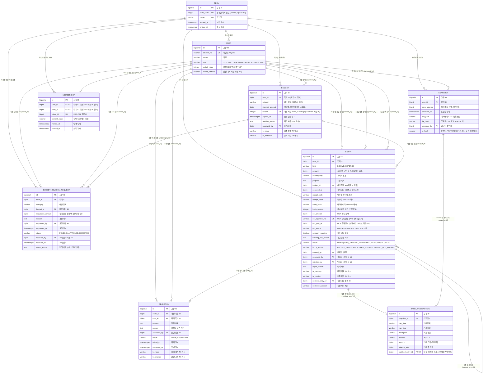

# 블록체인 기반 학생회 회계 투명성 관리 시스템 — 데이터베이스 모델 설계서 (ERD)

> **문서 버전**: v1.2 (2주차 전사 작업 및 HASHING·API·통장CSV 연동 동기화 완료)  
> **작성일**: 2026-09-20  
> **작성자**: 김경윤 (역할 B — 백엔드 회계·예산 도메인 `feat/backend-core`)  
> **기준 문서**:
> - `학생회비-투명성-시스템-PRD v0.7.md` (§4, §7, §8, §9)
> - `모바일프로젝트_요구사항명세서.xlsx` (FR-AUTH, FR-BUD, FR-INC, FR-EXP, FR-COR, FR-OCR, FR-VER, FR-OBJ, FR-BNK, FR-SBT, FR-RPT)
> - `2주차 할일.md` (§김경윤 2주차 필수 마일스톤)
> - `docs/enums.md`, `docs/CONTRACTS.md`, `docs/HASHING.md`, `docs/API.md`, `docs/BANK_CSV.md`
> **대상 RDBMS**: PostgreSQL 15+

---

## 1. 개요 및 설계 원칙

본 설계서는 블록체인 스마트 컨트랙트(`AccountingLedger`, `BudgetToken`, `MembershipSBT`)와 FastAPI 백엔드 간의 데이터 정합성을 보장하고, 모바일 앱(학생용/임원용)에서 실시간 검증 가능한 회계 데이터베이스 모델을 정의합니다.

### 1.1 핵심 주의사항 2대 원칙 (Mandatory Constraints)

1. **예산 개정은 Row 추가 + `version` 증가 (덮어쓰기 절대 금지)**
   - **원칙**: 예산 조정 및 개정 발생 시 기존 row의 `planned_amount`를 직접 `UPDATE`하지 않고, 동일한 `(term_id, category)`에 대해 `version`을 1씩 증가시키며 **새로운 row를 `INSERT`**합니다.
   - **근거 (FR-BUD-06, FR-RPT-05)**:
     - 결산 메타지표의 핵심인 **「예산 개정 N회, 그중 초과 집행 이후 개정 M회」** 및 **「개정 사유 추적」**은 이전 버전의 레코드가 그대로 보존되어야만 산출 가능합니다.
     - 기존 row를 덮어쓰면 초기 편성액과 중간 개정 이력이 영구 유실되어 감사의 불변성이 훼손됩니다.
   - **DB 구현**: `UNIQUE (term_id, category, version)` 복합 제약조건과 `CHECK (version = 1 OR revision_reason IS NOT NULL)`을 부여하여 개정(v2+) 시 개정 사유 입력을 강제합니다.

2. **금액은 원 단위 정수형 통일 (`BIGINT`, 컨트랙트 `int256` 1:1 대응)**
   - **원칙**: 모든 금액 관련 컬럼은 소수점이 없는 **원 단위 정수(`BIGINT`)**로 통일합니다.
   - **근거 (PRD §8, FR-EXP-02, FR-INC-01)**:
     - 스마트 컨트랙트가 `int256` / `uint256` 기반 정수 연산을 수행하므로, DB에서 `FLOAT`나 `DECIMAL` 소수점을 사용할 경우 부동소수점 오차나 반올림 불일치로 인해 온체인 검증 배지가 깨집니다.
     - 대한민국 원화(KRW)는 소수점 전표가 없으므로 정수 표현이 가장 안전하고 정확합니다.
   - **적용 컬럼**: `budgets.planned_amount`, `entries.amount`, `entries.ocr_amount`, `snapshots.bank_balance`.

### 1.2 회계 무결성 및 체인 규칙의 DB 선제 강제

1. **등록자 ≠ 승인자 분리 (Maker-Checker Rule, FR-EXP-12)**:
   - 스마트 컨트랙트의 `AccountingLedger`는 등록자와 승인자가 동일 주소일 경우 트랜잭션을 `revert`합니다.
   - DB 수준에서도 `CHECK (approved_by IS NULL OR created_by != approved_by)` 제약조건을 부여하여 총무의 셀프 승인을 원천 차단합니다.
2. **영수증 중복 청구 탐지 (FR-OCR-03)**:
   - `(ocr_approval_no, ocr_paid_at, amount)` 조건부 유니크 인덱스를 구축하여 동일 영수증의 이중 제출을 탐지 및 방지합니다.
3. **정정 분개 원칙 (FR-COR-01 ~ 04)**:
   - 마감 및 확정된 지출은 UPDATE/DELETE가 불가하며, `corrects_entry_id` 자기참조 외래키와 4종 사유(`INPUT_ERROR`, `RECEIPT_RECHECK`, `REFUND`, `RECLASSIFY`)를 가진 새 Entry를 등록하여 정정합니다.

---

## 2. ER 다이어그램 (Entity Relationship Diagram)



---

## 3. 엔티티 상세 명세서 (7종)

### 3.1 `users` (사용자 관리)
- **요구사항 매핑**: FR-AUTH-01(로그인), FR-AUTH-02(역할 분기), FR-AUTH-04(학생 지갑 파생), FR-AUTH-05/06(임원 키스토어)
- **설명**: 학생과 학생회 임원(총무, 감사, 회장)의 기본 프로필 및 블록체인 키 관리 매핑 테이블입니다.

| 컬럼명 | 데이터 타입 | Null | 기본값 | 제약조건 / 설명 |
| :--- | :--- | :---: | :---: | :--- |
| `id` | `BIGSERIAL` | N | Auto | **PK** |
| `student_no` | `VARCHAR(20)` | N | - | **UNIQUE**, 학번 |
| `name` | `VARCHAR(50)` | N | - | 사용자 성명 |
| `role` | `VARCHAR(20)` | N | - | Enum: `STUDENT`, `TREASURER`, `AUDITOR`, `PRESIDENT` |
| `wallet_index` | `INTEGER` | Y | NULL | **UNIQUE(NULL 제외)**, 학생 HD 월렛 파생 인덱스 (`m/44'/60'/0'/0/{index}`) |
| `wallet_address`| `VARCHAR(42)` | Y | NULL | **UNIQUE(NULL 제외)**, 임원 기기 키스토어 EVM 지갑 주소 (`0x...`) |
| `created_at` | `TIMESTAMPTZ` | N | `now()` | 계정 생성 일시 |

- **테이블 제약조건**:
  - `CONSTRAINT ck_users_role CHECK (role IN ('STUDENT', 'TREASURER', 'AUDITOR', 'PRESIDENT'))`
  - `CONSTRAINT ck_users_student_wallet CHECK (role != 'STUDENT' OR wallet_index IS NOT NULL)` (학생은 지갑 인덱스 필수)
  - `CONSTRAINT ck_users_council_wallet CHECK (role = 'STUDENT' OR wallet_address IS NOT NULL)` (임원은 서명용 지갑 주소 필수)
- **인덱스**:
  - `idx_users_role ON users (role)`
  - `idx_users_student_no ON users (student_no)`

---

### 3.2 `terms` (학기)
- **요구사항 매핑**: 회계 및 예산 통제의 시간적 기준 단위 (학기 단위 마감 및 SBT 유효 기간)
- **설명**: 2026학년도 2학기 등 학생회 회계 운영의 주기를 관리합니다.

| 컬럼명 | 데이터 타입 | Null | 기본값 | 제약조건 / 설명 |
| :--- | :--- | :---: | :---: | :--- |
| `id` | `BIGSERIAL` | N | Auto | **PK** (스마트 컨트랙트 규격 1부터 시작) |
| `term_code` | `INTEGER` | N | - | **UNIQUE**, 온체인 학기 코드 (`YYYYS` 형식, 예: `20261`, `uint32` 호환) |
| `name` | `VARCHAR(50)` | N | - | **UNIQUE**, 학기 명칭 (예: "2026-2학기") |
| `started_at` | `TIMESTAMPTZ` | N | - | 학기 시작 일시 |
| `ended_at` | `TIMESTAMPTZ` | N | - | 학기 종료 일시 |
| `created_at` | `TIMESTAMPTZ` | N | `now()` | 등록 일시 |

- **테이블 제약조건**:
  - `CONSTRAINT uq_terms_term_code UNIQUE (term_code)`
  - `CONSTRAINT uq_terms_name UNIQUE (name)`
  - `CONSTRAINT ck_terms_dates CHECK (started_at < ended_at)` (시작일은 종료일보다 이전)
  - `CONSTRAINT ck_terms_code CHECK (term_code > 0)` (학기 코드는 양의 정수)
- **인덱스**:
  - `idx_terms_term_code ON terms (term_code)`
  - `idx_terms_dates ON terms (started_at, ended_at)`

---

### 3.3 `budgets` (예산 관리 및 개정 이력)
- **요구사항 매핑**: FR-BUD-01(예산 편성), FR-BUD-02(토큰 발행), FR-BUD-04(초과 차단), FR-BUD-06(개정 이력 보존), FR-BUD-07(개정 사유/승인), FR-BUD-08(개정 토큰 추가발행)
- **설명**: 학기별 항목(행사비, 비품비, 식비 등)의 예산 편성액 및 개정 이력을 관리합니다.

> [!IMPORTANT]
> **핵심 원칙 1: 개정 시 Row 추가 + `version` 증가**
> - 본 테이블은 온체인 `BudgetToken`과 1:1로 대응되는 **"확정된 예산 버전 원장"**만을 저장합니다.
> - 개정 신청, 대기(`PENDING`), 반려(`REJECTED`)의 라이프사이클은 `budget_revision_requests` 테이블에서 분리 관리되며, 승인 시 본 테이블에 새 버전(`version = 이전+1`) row가 삽입됩니다.
> - 이전 버전의 `planned_amount`가 그대로 보존되므로 결산 시 개정 전/후 비교 및 통계 지표 산출이 완벽히 지원됩니다.

| 컬럼명 | 데이터 타입 | Null | 기본값 | 제약조건 / 설명 |
| :--- | :--- | :---: | :---: | :--- |
| `id` | `BIGSERIAL` | N | Auto | **PK** |
| `term_id` | `BIGINT` | N | - | **FK** -> `terms(id)` ON DELETE RESTRICT |
| `category` | `VARCHAR(50)` | N | - | 예산 항목명 (행사비, 비품비, 학생복지비 등) |
| `planned_amount`| `BIGINT` | N | - | **원 단위 정수 (int256 대응)**, 편성 금액 |
| `version` | `INTEGER` | N | 1 | 예산 버전 (1: 최초 편성, 2+: 개정 버전) |
| `expires_at` | `TIMESTAMPTZ` | N | - | 예산 집행 유효 만료일 (`BudgetToken.expiresAt`) |
| `revision_reason`| `TEXT` | Y | NULL | 개정 사유 (**버전 2 이상일 때 필수**) |
| `approved_by` | `BIGINT` | Y | NULL | **FK** -> `users(id)` ON DELETE RESTRICT (승인한 감사/회장) |
| `tx_issue` | `VARCHAR(66)` | Y | NULL | v1 최초 토큰 발행 트랜잭션 해시 (`0x...`) |
| `tx_increase` | `VARCHAR(66)` | Y | NULL | v2+ 개정 증액 토큰 발행 트랜잭션 해시 (`0x...`) |
| `created_at` | `TIMESTAMPTZ` | N | `now()` | 레코드 생성 일시 |

- **테이블 제약조건**:
  - `CONSTRAINT uq_budgets_term_category_version UNIQUE (term_id, category, version)` (동일 학기/카테고리 내 버전 중복 방지)
  - `CONSTRAINT ck_budgets_amount CHECK (planned_amount >= 0)` (편성액은 0원 이상 정수)
  - `CONSTRAINT ck_budgets_version CHECK (version >= 1)` (버전은 1부터 시작)
  - `CONSTRAINT ck_budgets_revision_reason CHECK (version = 1 OR revision_reason IS NOT NULL)` (개정 시 사유 필수)
- **인덱스**:
  - `idx_budgets_lookup ON budgets (term_id, category, version DESC)` (최신 예산 버전 고속 조회용 복합 인덱스)
  - `idx_budgets_approved_by ON budgets (approved_by)`

---

### 3.4 `entries` (수입·지출 원장)
- **요구사항 매핑**: FR-INC-01/02(수입 등록/승인), FR-EXP-01~13(지출 전체), FR-COR-01~05(정정), FR-OCR-01~08(영수증 OCR 판독 및 경고)
- **설명**: 시스템의 핵심 회계 장부 테이블입니다. 1단계 초안(`status IS NULL`) 생성 후 2단계 기기 서명 제출 시 온체인 `Pending` 해시가 기록되고, 감사 승인 시 `Confirmed`로 확정됩니다. 예산 초과 시 감사 추적을 위해 `Blocked` 상태로 등록됩니다.

> [!IMPORTANT]
> **핵심 원칙 2: 금액의 원 단위 정수형(`BIGINT`) 및 타임스탬프 규격 통일**
> - `amount`, `ocr_amount`는 모두 `BIGINT` 타입으로 지정되어 소수점 절삭이나 오차를 원천 차단합니다.
> - `occurred_at`은 거래 사용일의 **KST 00:00:00 기준 Unix 초(정수)**(`ts % 86400 == 54000`)로 고정하여 클라이언트/서버 간 시각 편차로 인한 해시 불일치를 방지합니다. (영수증 시·분·초는 `ocr_paid_at`에 보존)

| 컬럼명 | 데이터 타입 | Null | 기본값 | 제약조건 / 설명 |
| :--- | :--- | :---: | :---: | :--- |
| `id` | `BIGSERIAL` | N | Auto | **PK** (스마트 컨트랙트 규격 1부터 시작) |
| `term_id` | `BIGINT` | N | - | **FK** -> `terms(id)` ON DELETE RESTRICT |
| `kind` | `VARCHAR(20)` | N | - | Enum: `INCOME`, `EXPENSE` |
| `amount` | `BIGINT` | N | - | **원 단위 정수 (int256 대응)**, `CHECK (amount > 0)` |
| `counterparty` | `VARCHAR(100)`| N | - | 사용처 / 입금자 상호 (예: 청년피자, 한결문구) |
| `purpose` | `TEXT` | N | - | 사용 목적 / 내용 요약 |
| `budget_id` | `BIGINT` | Y | NULL | **FK** -> `budgets(id)` ON DELETE RESTRICT (지출 시 필수 바인딩) |
| `occurred_at` | `BIGINT` | N | - | 거래 발생 일자 (**KST 00:00:00 기준 Unix 초 정수**) |
| `receipt_path` | `VARCHAR(255)`| Y | NULL | 영수증 이미지 파일 오프체인 저장 경로 |
| `receipt_hash` | `VARCHAR(66)` | Y | NULL | 영수증 원본의 SHA256 해시 (`0x` + 64 hex 소문자) |
| `meta_hash` | `VARCHAR(66)` | Y | NULL | `SHA256(amount\|counterparty\|purpose\|occurred_at\|receipt_hash)` |
| `hash_version` | `INTEGER` | N | 1 | 해시 계산 규칙 버전 (규칙 변경 시 배지 호환성 보존) |
| `ocr_amount` | `BIGINT` | Y | NULL | OCR 판독 결제 금액 (원 단위 정수) |
| `ocr_approval_no`| `VARCHAR(50)`| Y | NULL | OCR 판독 카드 승인번호 |
| `ocr_paid_at` | `BIGINT` | Y | NULL | OCR 판독 실제 결제 일시 (Unix 초 정수) |
| `ocr_status` | `VARCHAR(20)` | Y | NULL | Enum: `MATCH`, `MISMATCH`, `DUPLICATE`, `NO_NUMBER`, `UNREADABLE` |
| `category_warning`| `BOOLEAN` | N | FALSE | 용도 불일치 의심 경고 여부 |
| `warning_ack_reason`| `TEXT` | Y | NULL | 경고 상태로 승인 시 감사가 입력한 소명 사유 |
| `status` | `VARCHAR(20)` | Y | NULL | 초안은 `NULL(DRAFT)`, 체인: `PENDING`, `CONFIRMED`, `REJECTED`, `BLOCKED` |
| `block_reason` | `VARCHAR(30)` | Y | NULL | Enum: `BUDGET_EXCEEDED`, `BUDGET_EXPIRED`, `BUDGET_NOT_FOUND` |
| `created_by` | `BIGINT` | N | - | **FK** -> `users(id)` ON DELETE RESTRICT (작성자: 총무) |
| `approved_by` | `BIGINT` | Y | NULL | **FK** -> `users(id)` ON DELETE RESTRICT (승인자: 감사/회장) |
| `rejected_by` | `BIGINT` | Y | NULL | **FK** -> `users(id)` ON DELETE RESTRICT (반려자: 감사/회장) |
| `reject_reason`| `TEXT` | Y | NULL | 반려 사유 (`status = 'REJECTED'` 시 필수) |
| `tx_pending` | `VARCHAR(66)` | Y | NULL | 온체인 Pending/Blocked 기록 TX 해시 (`0x...`) |
| `tx_confirm` | `VARCHAR(66)` | Y | NULL | 온체인 Confirmed 확정 TX 해시 (`0x...`) |
| `corrects_entry_id`| `BIGINT` | Y | NULL | **FK** -> `entries(id)` ON DELETE RESTRICT (정정 대상 원본 Entry ID) |
| `correction_reason`| `VARCHAR(30)`| Y | NULL | Enum: `INPUT_ERROR`, `RECEIPT_RECHECK`, `REFUND`, `RECLASSIFY` |
| `created_at` | `TIMESTAMPTZ` | N | `now()` | 시스템 등록 일시 |

- **테이블 제약조건**:
  - `CONSTRAINT ck_entries_kind CHECK (kind IN ('INCOME', 'EXPENSE'))`
  - `CONSTRAINT ck_entries_amount CHECK (amount > 0)`
  - `CONSTRAINT ck_entries_ocr_amount CHECK (ocr_amount IS NULL OR ocr_amount >= 0)`
  - `CONSTRAINT ck_entries_status CHECK (status IS NULL OR status IN ('PENDING', 'CONFIRMED', 'REJECTED', 'BLOCKED'))`
  - `CONSTRAINT ck_entries_block_reason CHECK (block_reason IS NULL OR block_reason IN ('BUDGET_EXCEEDED', 'BUDGET_EXPIRED', 'BUDGET_NOT_FOUND'))`
  - `CONSTRAINT ck_entries_ocr_status CHECK (ocr_status IS NULL OR ocr_status IN ('MATCH', 'MISMATCH', 'DUPLICATE', 'NO_NUMBER', 'UNREADABLE'))`
  - `CONSTRAINT ck_entries_correction_reason CHECK (correction_reason IS NULL OR correction_reason IN ('INPUT_ERROR', 'RECEIPT_RECHECK', 'REFUND', 'RECLASSIFY'))`
  - `CONSTRAINT ck_entries_expense_budget CHECK (kind = 'INCOME' OR budget_id IS NOT NULL)` (지출은 예산 매핑 필수)
  - `CONSTRAINT ck_entries_maker_checker CHECK (approved_by IS NULL OR created_by != approved_by)` (**등록자 ≠ 승인자 분리 강제**)
  - `CONSTRAINT ck_entries_rejected_maker CHECK (rejected_by IS NULL OR created_by != rejected_by)` (**등록자 ≠ 반려자 분리**)
  - `CONSTRAINT ck_entries_no_self_correct CHECK (corrects_entry_id IS NULL OR corrects_entry_id != id)` (자기 자신 정정 금지)
  - `CONSTRAINT ck_entries_correct_reason_req CHECK (corrects_entry_id IS NULL OR correction_reason IS NOT NULL)` (정정 등록 시 사유 필수)
  - `CONSTRAINT ck_entries_reject_reason CHECK (status != 'REJECTED' OR reject_reason IS NOT NULL)` (반려 시 사유 필수)
- **인덱스**:
  - **영수증 중복 청구 방지 조건부 유니크 인덱스 (FR-OCR-03, PRD §8)**:
    ```sql
    CREATE UNIQUE INDEX uq_entries_ocr_dup 
    ON entries (ocr_approval_no, ocr_paid_at, amount) 
    WHERE ocr_approval_no IS NOT NULL AND status != 'REJECTED';
    ```
  - `idx_entries_dashboard ON entries (term_id, kind, status)` (잔액 및 집행률 산출 최적화)
  - `idx_entries_budget_id ON entries (budget_id)` (예산별 소모액 집계 최적화)
  - `idx_entries_occurred_at ON entries (occurred_at DESC)` (목록 최신순 페이징)
  - `idx_entries_created_by ON entries (created_by)`
  - `idx_entries_approved_by ON entries (approved_by)`
  - `idx_entries_rejected_by ON entries (rejected_by)`
  - `idx_entries_corrects_entry_id ON entries (corrects_entry_id)` (정정 내역 추적)

---

### 3.5 `snapshots` (통장 잔액 및 거래내역 스냅샷)
- **요구사항 매핑**: FR-BNK-01(거래내역 조회/업로드), FR-BNK-05(차액 경고), FR-BNK-06(수동 스냅샷)
- **설명**: 총무가 은행 인터넷뱅킹에서 내려받은 거래내역 원본 CSV 파일 및 확인 잔액을 기록하고 온체인에 커밋합니다. 원본 파일의 위변조 방지를 위해 바이트 그대로 해시(`file_hash`)하여 보존합니다.

| 컬럼명 | 데이터 타입 | Null | 기본값 | 제약조건 / 설명 |
| :--- | :--- | :---: | :---: | :--- |
| `id` | `BIGSERIAL` | N | Auto | **PK** |
| `term_id` | `BIGINT` | N | - | **FK** -> `terms(id)` ON DELETE RESTRICT |
| `bank_balance` | `BIGINT` | N | - | **원 단위 정수 (int256 대응)**, 실제 은행 잔액 (`CHECK >= 0`) |
| `snapshot_at` | `TIMESTAMPTZ` | N | `now()` | 잔액 확인 일시 |
| `csv_path` | `VARCHAR(255)`| Y | NULL | 업로드된 거래내역 원본 CSV 파일 저장 경로 |
| `file_hash` | `VARCHAR(66)` | Y | NULL | 원본 CSV 바이트 SHA-256 해시 (`0x...`) |
| `uploaded_by` | `BIGINT` | Y | NULL | **FK** -> `users(id)` ON DELETE RESTRICT (업로드 총무) |
| `tx_hash` | `VARCHAR(66)` | Y | NULL | 온체인 잔액 기록 TX 해시 (*IAccountingLedger.recordBankSnapshot 삭제로 컨트랙트 함수 확정 대기) |
| `created_at` | `TIMESTAMPTZ` | N | `now()` | 등록 일시 |

- **테이블 제약조건**:
  - `CONSTRAINT ck_snapshots_balance CHECK (bank_balance >= 0)`
- **인덱스**:
  - `idx_snapshots_term_at ON snapshots (term_id, snapshot_at DESC)` (최신 잔액 스냅샷 조회)
  - `idx_snapshots_uploaded_by ON snapshots (uploaded_by)`

---

### 3.6 `memberships` (SBT 회원권 관리)
- **요구사항 매핑**: FR-SBT-01(SBT 발급), FR-SBT-02(전송 불가), FR-SBT-06(학번 해시 커밋), FR-SBT-07(회수)
- **설명**: 학생회비를 납부한 학생에게 학기 단위로 부여되는 ERC-721 기반 소울바운드 토큰(SBT)의 오프체인 매핑입니다.

| 컬럼명 | 데이터 타입 | Null | 기본값 | 제약조건 / 설명 |
| :--- | :--- | :---: | :---: | :--- |
| `id` | `BIGSERIAL` | N | Auto | **PK** |
| `user_id` | `BIGINT` | N | - | **FK** -> `users(id)` ON DELETE RESTRICT |
| `term_id` | `BIGINT` | N | - | **FK** -> `terms(id)` ON DELETE RESTRICT |
| `token_id` | `BIGINT` | N | - | **UNIQUE**, 온체인 ERC-721 토큰 ID |
| `commit_hash` | `VARCHAR(66)` | N | - | 학번+salt 커밋 해시 (개인정보 보호, 온체인 기록) |
| `minted_at` | `TIMESTAMPTZ` | N | `now()` | 발급 일시 |
| `burned_at` | `TIMESTAMPTZ` | Y | NULL | 소각/환불 회수 일시 |
| `created_at` | `TIMESTAMPTZ` | N | `now()` | 등록 일시 |

- **테이블 제약조건**:
  - `CONSTRAINT ck_memberships_burn_date CHECK (burned_at IS NULL OR burned_at >= minted_at)`
- **인덱스**:
  - `uq_memberships_active_user_term ON memberships (user_id, term_id) WHERE burned_at IS NULL` (**활성 SBT 학기당 1인 1발급 보장 및 소각 후 재발행 허용 부분 유니크 인덱스**)
  - `idx_memberships_lookup ON memberships (user_id, term_id)`
  - `idx_memberships_commit_hash ON memberships (commit_hash)`

---

### 3.7 `objections` (이의 제기 및 감사 답변)
- **요구사항 매핑**: FR-OBJ-01(이의 제기), FR-OBJ-02(이의 답변), FR-OBJ-03(해시 온체인 기록), FR-OBJ-04/05(미답변 집계)
- **설명**: 확정된 지출에 대해 일반 학생이 투명하게 질문을 제기하고 학생회가 공식 답변을 등록하는 감사 소명 창구입니다.

| 컬럼명 | 데이터 타입 | Null | 기본값 | 제약조건 / 설명 |
| :--- | :--- | :---: | :---: | :--- |
| `id` | `BIGSERIAL` | N | Auto | **PK** |
| `entry_id` | `BIGINT` | N | - | **FK** -> `entries(id)` ON DELETE RESTRICT |
| `user_id` | `BIGINT` | N | - | **FK** -> `users(id)` ON DELETE RESTRICT (질문한 학생) |
| `content` | `TEXT` | N | - | 이의 질문 내용 |
| `answer` | `TEXT` | Y | NULL | 학생회 공식 답변 내용 |
| `answered_by` | `BIGINT` | Y | NULL | **FK** -> `users(id)` ON DELETE RESTRICT (답변한 임원) |
| `status` | `VARCHAR(20)` | N | 'OPEN' | Enum: `OPEN`, `ANSWERED` |
| `raised_at` | `TIMESTAMPTZ` | N | `now()` | 이의 제기 일시 |
| `answered_at` | `TIMESTAMPTZ` | Y | NULL | 답변 완료 일시 |
| `tx_raise` | `VARCHAR(66)` | Y | NULL | 이의 제기 온체인 해시 기록 TX |
| `tx_answer` | `VARCHAR(66)` | Y | NULL | 답변 온체인 해시 기록 TX |
| `created_at` | `TIMESTAMPTZ` | N | `now()` | 등록 일시 |

- **테이블 제약조건**:
  - `CONSTRAINT ck_objections_status CHECK (status IN ('OPEN', 'ANSWERED'))`
  - `CONSTRAINT ck_objections_answered_state CHECK (status = 'OPEN' OR (answer IS NOT NULL AND answered_by IS NOT NULL AND answered_at IS NOT NULL))`
  - `CONSTRAINT ck_objections_dates CHECK (answered_at IS NULL OR answered_at >= raised_at)`
- **인덱스**:
  - `idx_objections_entry_id ON objections (entry_id)`
  - `idx_objections_status ON objections (status)` (미답변 이의 건수 신속 집계용)

---

### 3.8 `bank_transactions` (은행 거래내역 대조 관리)
- **요구사항 매핑**: FR-BNK-01(통장 거래내역 CSV 파싱), FR-BNK-02(미등록 거래 탐지), FR-BNK-05(차액 대조)
- **설명**: 총무가 업로드한 통장 CSV 파일(NH농협, KB국민 등)을 정규화 파싱하여 건별 거래를 보관하고, 회계 원장(`entries`)과 1:1 대조 매칭(`matched_entry_id`)을 수행합니다. 계좌 출금은 발생했으나 장부에 누락된 거래(미등록 지출)나 반대로 장부에는 있으나 실제 계좌 출금이 없는 허위 거래를 적발합니다.

| 컬럼명 | 데이터 타입 | Null | 기본값 | 제약조건 / 설명 |
| :--- | :--- | :---: | :---: | :--- |
| `id` | `BIGSERIAL` | N | Auto | **PK** |
| `snapshot_id` | `BIGINT` | N | - | **FK** -> `snapshots(id)` ON DELETE CASCADE |
| `tran_date` | `VARCHAR(10)` | N | - | 거래일자 (`YYYY-MM-DD`) |
| `tran_time` | `VARCHAR(8)` | Y | NULL | 거래시각 (`HH:MM:SS`) |
| `description` | `VARCHAR(100)`| N | - | 적요 원문 (가공 없이 보존) |
| `direction` | `VARCHAR(10)` | N | - | 입출 구분 (`IN`, `OUT`) |
| `amount` | `BIGINT` | N | - | **거래 금액 (원 단위 양수 정수)**, `CHECK (amount > 0)` |
| `balance_after`| `BIGINT` | N | - | 거래 후 계좌 잔액 (원 단위 정수) |
| `matched_entry_id`| `BIGINT` | Y | NULL | **FK, UNIQUE(NULL 제외)** -> `entries(id)` ON DELETE SET NULL (대조 매칭된 원장 ID, 1:1 소모 매칭 보장) |
| `created_at` | `TIMESTAMPTZ` | N | `now()` | 파싱 등록 일시 |

- **테이블 제약조건**:
  - `CONSTRAINT ck_bank_tran_direction CHECK (direction IN ('IN', 'OUT'))`
  - `CONSTRAINT ck_bank_tran_amount CHECK (amount > 0)`
  - `CONSTRAINT ck_bank_tran_balance CHECK (balance_after >= 0)`
- **인덱스**:
  - `idx_bank_tran_snapshot ON bank_transactions (snapshot_id)`
  - `uq_bank_tran_matched_entry ON bank_transactions (matched_entry_id) WHERE matched_entry_id IS NOT NULL` (**원장-통장 1:1 소모 매칭 강제 부분 유니크 인덱스**)
  - `idx_bank_tran_unmatched ON bank_transactions (snapshot_id, matched_entry_id) WHERE matched_entry_id IS NULL` (미등록 계좌 거래 고속 적발)

---

### 3.9 `budget_revision_requests` (예산 개정 요청 관리)
- **요구사항 매핑**: FR-BUD-06(예산 개정 신청), FR-BUD-07(개정 사유 및 승인/반려), 스토리보드 16번(예산 개정 승인 화면)
- **설명**: 총무가 제출한 예산 증액/개정 신청의 대기(`PENDING`), 승인(`APPROVED`), 반려(`REJECTED`) 라이프사이클을 관리합니다. 감사가 반려할 경우 블록체인 트랜잭션 없이 서버(DB)에만 반려 사유를 남겨 이력을 추적하며, 승인할 경우 `budgets` 테이블에 새 버전(`version = 이전+1`) row가 생성되고 온체인 `tx_increase`가 기록됩니다.

| 컬럼명 | 데이터 타입 | Null | 기본값 | 제약조건 / 설명 |
| :--- | :--- | :---: | :---: | :--- |
| `id` | `BIGSERIAL` | N | Auto | **PK** |
| `term_id` | `BIGINT` | N | - | **FK** -> `terms(id)` ON DELETE RESTRICT |
| `category` | `VARCHAR(50)` | N | - | 예산 항목명 |
| `budget_id` | `BIGINT` | Y | NULL | **FK** -> `budgets(id)` ON DELETE SET NULL (기존 편성된 예산 ID) |
| `requested_amount`| `BIGINT` | N | - | **원 단위 정수 (int256 대응)**, 변경/증액 요청 금액 |
| `reason` | `TEXT` | N | - | 개정 요청 사유 |
| `requested_by` | `BIGINT` | N | - | **FK** -> `users(id)` ON DELETE RESTRICT (신청 총무) |
| `requested_at` | `TIMESTAMPTZ` | N | `now()` | 개정 신청 일시 |
| `status` | `VARCHAR(20)` | N | 'PENDING'| Enum: `PENDING`, `APPROVED`, `REJECTED` |
| `resolved_by` | `BIGINT` | Y | NULL | **FK** -> `users(id)` ON DELETE RESTRICT (승인/반려한 감사 또는 회장) |
| `resolved_at` | `TIMESTAMPTZ` | Y | NULL | 처리 일시 |
| `reject_reason`| `TEXT` | Y | NULL | 반려 사유 (반려 시 필수, 서버 전용 기록) |
| `created_at` | `TIMESTAMPTZ` | N | `now()` | 레코드 등록 일시 |

- **테이블 제약조건**:
  - `CONSTRAINT ck_budget_rev_status CHECK (status IN ('PENDING', 'APPROVED', 'REJECTED'))`
  - `CONSTRAINT ck_budget_rev_amount CHECK (requested_amount >= 0)`
  - `CONSTRAINT ck_budget_rev_resolved CHECK (status = 'PENDING' OR (resolved_by IS NOT NULL AND resolved_at IS NOT NULL))`
  - `CONSTRAINT ck_budget_rev_reject_reason CHECK (status != 'REJECTED' OR reject_reason IS NOT NULL)` (반려 시 사유 필수)
  - `CONSTRAINT ck_budget_rev_maker_checker CHECK (resolved_by IS NULL OR requested_by != resolved_by)` (신청자 ≠ 처리자 분리)
- **인덱스**:
  - `idx_budget_rev_pending ON budget_revision_requests (term_id, status) WHERE status = 'PENDING'` (감사 대기 목록 고속 조회)
  - `idx_budget_rev_budget ON budget_revision_requests (budget_id)`
  - `idx_budget_rev_requested_by ON budget_revision_requests (requested_by)`

---

## 4. 요구사항명세서(Excel) 기능별 데이터 모델 매핑 추적표

| 기능 코드 | 기능명 (Excel 명세서) | 관련 테이블 및 컬럼 | 데이터 모델 반영 내용 |
| :--- | :--- | :--- | :--- |
| `FR-AUTH-04` | 학생 지갑 파생 | `users.wallet_index` | HD 월렛 인덱스 저장 (`m/44'/60'/0'/0/{index}`) |
| `FR-AUTH-05` | 임원 키 서버 미보관 | `users.wallet_address` | 서버는 주소만 저장, 개인키는 기기 키스토어 보관 |
| `FR-BUD-01` | 예산 편성 | `budgets` (v1) | 카테고리, 금액, 만료일 저장 |
| `FR-BUD-06` | **예산 개정** | `budgets` (v2+) | **Row 추가 + version 증가, 이전 버전 보존** |
| `FR-BUD-07` | 개정 사유·승인 | `budgets.revision_reason`, `approved_by` | 개정 시 사유 입력 필수 제약 |
| `FR-EXP-04` | **BLOCKED 기록** | `entries.status = 'BLOCKED'`, `block_reason` | 예산 초과 거부 시도 및 사유 DB 보존 |
| `FR-EXP-06` | Pending 온체인 기록 | `entries.meta_hash`, `tx_pending` | 오프체인 메타데이터 SHA256 해시화 (KST 자정 기준) |
| `FR-EXP-12` | **등록자·승인자·반려자 분리**| `entries(created_by, approved_by, rejected_by)` | 등록자 ≠ 승인자 및 등록자 ≠ 반려자 DB 강제 |
| `FR-COR-01` | 정정 등록 | `entries.corrects_entry_id` | 원본 불변, 새 Entry로 연결 분개 |
| `FR-COR-04` | 정정 사유 유형 | `entries.correction_reason` | 4종 규격화된 Enum 선택 강제 |
| `FR-OCR-03` | **중복 제출 탐지** | `entries(ocr_approval_no, ocr_paid_at, amount)` | 조건부 복합 유니크 인덱스로 이중 제출 차단 |
| `FR-OCR-06` | 경고 승인 사유 | `entries.warning_ack_reason` | OCR/용도 경고 무시 승인 시 사유 강제 |
| `FR-OBJ-04` | 미답변 표시 | `objections.status = 'OPEN'` | 대시보드 미답변 카운트 인덱스 |
| `FR-BNK-01` | **통장 CSV 업로드·파싱** | `snapshots.file_hash`, `bank_transactions` | 원본 파일 해시 보존 및 정규화 내역 저장 |
| `FR-BNK-02` | **미등록 거래 탐지** | `bank_transactions.matched_entry_id` | 통장 내역과 원장 간 1:1 소모식 대조 매칭 |
| `FR-BNK-06` | 수동/스냅샷 잔액 | `snapshots.bank_balance` | 원 단위 정수 잔액 보관 |
| `FR-RPT-05` | **예산 개정 패턴** | `budgets.version`, `entries.status` | 개정 횟수 및 초과 집행 후 개정 비율 집계 |

---

## 5. PostgreSQL DDL 실행 스크립트

다음 SQL 스크립트를 PostgreSQL 데이터베이스에 실행하여 완벽한 무결성을 가진 테이블과 인덱스를 즉시 생성할 수 있습니다.

```sql
-- =============================================================================
-- 블록체인 기반 학생회 회계 투명성 관리 시스템 - DDL 스크립트
-- 버전: v1.1
-- 대상 RDBMS: PostgreSQL 15+
-- =============================================================================

BEGIN;

-- 1. 사용자 테이블 (users)
CREATE TABLE users (
    id BIGSERIAL PRIMARY KEY,
    student_no VARCHAR(20) NOT NULL,
    name VARCHAR(50) NOT NULL,
    role VARCHAR(20) NOT NULL,
    wallet_index INTEGER NULL,
    wallet_address VARCHAR(42) NULL,
    created_at TIMESTAMPTZ NOT NULL DEFAULT CURRENT_TIMESTAMP,
    CONSTRAINT uq_users_student_no UNIQUE (student_no),
    CONSTRAINT uq_users_wallet_index UNIQUE (wallet_index),
    CONSTRAINT uq_users_wallet_address UNIQUE (wallet_address),
    CONSTRAINT ck_users_role CHECK (role IN ('STUDENT', 'TREASURER', 'AUDITOR', 'PRESIDENT')),
    CONSTRAINT ck_users_student_wallet CHECK (role != 'STUDENT' OR wallet_index IS NOT NULL),
    CONSTRAINT ck_users_council_wallet CHECK (role = 'STUDENT' OR wallet_address IS NOT NULL)
);

CREATE INDEX idx_users_role ON users (role);
CREATE INDEX idx_users_student_no ON users (student_no);


-- 2. 학기 테이블 (terms)
CREATE TABLE terms (
    id BIGSERIAL PRIMARY KEY,
    term_code INTEGER NOT NULL,
    name VARCHAR(50) NOT NULL,
    started_at TIMESTAMPTZ NOT NULL,
    ended_at TIMESTAMPTZ NOT NULL,
    created_at TIMESTAMPTZ NOT NULL DEFAULT CURRENT_TIMESTAMP,
    CONSTRAINT uq_terms_term_code UNIQUE (term_code),
    CONSTRAINT uq_terms_name UNIQUE (name),
    CONSTRAINT ck_terms_dates CHECK (started_at < ended_at),
    CONSTRAINT ck_terms_code CHECK (term_code > 0)
);

CREATE UNIQUE INDEX idx_terms_term_code ON terms (term_code);
CREATE INDEX idx_terms_dates ON terms (started_at, ended_at);


-- 3. 예산 테이블 (budgets)
-- 주의 1: 예산 개정은 row 추가 + version 증가 (기존 row UPDATE 금지)
-- 주의 2: planned_amount는 소수점 없는 원 단위 정수 (BIGINT, int256 호환)
CREATE TABLE budgets (
    id BIGSERIAL PRIMARY KEY,
    term_id BIGINT NOT NULL,
    category VARCHAR(50) NOT NULL,
    planned_amount BIGINT NOT NULL,
    version INTEGER NOT NULL DEFAULT 1,
    expires_at TIMESTAMPTZ NOT NULL,
    revision_reason TEXT NULL,
    approved_by BIGINT NULL,
    tx_issue VARCHAR(66) NULL,
    tx_increase VARCHAR(66) NULL,
    created_at TIMESTAMPTZ NOT NULL DEFAULT CURRENT_TIMESTAMP,
    CONSTRAINT fk_budgets_term FOREIGN KEY (term_id) REFERENCES terms(id) ON DELETE RESTRICT,
    CONSTRAINT fk_budgets_approver FOREIGN KEY (approved_by) REFERENCES users(id) ON DELETE RESTRICT,
    CONSTRAINT uq_budgets_term_category_version UNIQUE (term_id, category, version),
    CONSTRAINT ck_budgets_amount CHECK (planned_amount >= 0),
    CONSTRAINT ck_budgets_version CHECK (version >= 1),
    CONSTRAINT ck_budgets_revision_reason CHECK (version = 1 OR revision_reason IS NOT NULL)
);

CREATE INDEX idx_budgets_lookup ON budgets (term_id, category, version DESC);
CREATE INDEX idx_budgets_approved_by ON budgets (approved_by);


-- 4. 수입·지출 항목 테이블 (entries)
-- 주의 1: amount 및 ocr_amount는 원 단위 정수 (BIGINT, int256 호환)
-- 주의 2: occurred_at은 사용일 KST 자정 Unix초 정수 (ts % 86400 == 54000)
CREATE TABLE entries (
    id BIGSERIAL PRIMARY KEY,
    term_id BIGINT NOT NULL,
    kind VARCHAR(20) NOT NULL,
    amount BIGINT NOT NULL,
    counterparty VARCHAR(100) NOT NULL,
    purpose TEXT NOT NULL,
    budget_id BIGINT NULL,
    occurred_at BIGINT NOT NULL,
    receipt_path VARCHAR(255) NULL,
    receipt_hash VARCHAR(66) NULL,
    meta_hash VARCHAR(66) NULL,
    hash_version INTEGER NOT NULL DEFAULT 1,
    ocr_amount BIGINT NULL,
    ocr_approval_no VARCHAR(50) NULL,
    ocr_paid_at BIGINT NULL,
    ocr_status VARCHAR(20) NULL,
    category_warning BOOLEAN NOT NULL DEFAULT FALSE,
    warning_ack_reason TEXT NULL,
    status VARCHAR(20) NULL,
    block_reason VARCHAR(30) NULL,
    created_by BIGINT NOT NULL,
    approved_by BIGINT NULL,
    rejected_by BIGINT NULL,
    reject_reason TEXT NULL,
    tx_pending VARCHAR(66) NULL,
    tx_confirm VARCHAR(66) NULL,
    corrects_entry_id BIGINT NULL,
    correction_reason VARCHAR(30) NULL,
    created_at TIMESTAMPTZ NOT NULL DEFAULT CURRENT_TIMESTAMP,
    CONSTRAINT fk_entries_term FOREIGN KEY (term_id) REFERENCES terms(id) ON DELETE RESTRICT,
    CONSTRAINT fk_entries_budget FOREIGN KEY (budget_id) REFERENCES budgets(id) ON DELETE RESTRICT,
    CONSTRAINT fk_entries_creator FOREIGN KEY (created_by) REFERENCES users(id) ON DELETE RESTRICT,
    CONSTRAINT fk_entries_approver FOREIGN KEY (approved_by) REFERENCES users(id) ON DELETE RESTRICT,
    CONSTRAINT fk_entries_rejecter FOREIGN KEY (rejected_by) REFERENCES users(id) ON DELETE RESTRICT,
    CONSTRAINT fk_entries_corrects FOREIGN KEY (corrects_entry_id) REFERENCES entries(id) ON DELETE RESTRICT,
    CONSTRAINT ck_entries_kind CHECK (kind IN ('INCOME', 'EXPENSE')),
    CONSTRAINT ck_entries_amount CHECK (amount > 0),
    CONSTRAINT ck_entries_ocr_amount CHECK (ocr_amount IS NULL OR ocr_amount >= 0),
    CONSTRAINT ck_entries_status CHECK (status IS NULL OR status IN ('PENDING', 'CONFIRMED', 'REJECTED', 'BLOCKED')),
    CONSTRAINT ck_entries_block_reason CHECK (block_reason IS NULL OR block_reason IN ('BUDGET_EXCEEDED', 'BUDGET_EXPIRED', 'BUDGET_NOT_FOUND')),
    CONSTRAINT ck_entries_ocr_status CHECK (ocr_status IS NULL OR ocr_status IN ('MATCH', 'MISMATCH', 'DUPLICATE', 'NO_NUMBER', 'UNREADABLE')),
    CONSTRAINT ck_entries_correction_reason CHECK (correction_reason IS NULL OR correction_reason IN ('INPUT_ERROR', 'RECEIPT_RECHECK', 'REFUND', 'RECLASSIFY')),
    CONSTRAINT ck_entries_expense_budget CHECK (kind = 'INCOME' OR budget_id IS NOT NULL),
    CONSTRAINT ck_entries_maker_checker CHECK (approved_by IS NULL OR created_by != approved_by),
    CONSTRAINT ck_entries_rejected_maker CHECK (rejected_by IS NULL OR created_by != rejected_by),
    CONSTRAINT ck_entries_no_self_correct CHECK (corrects_entry_id IS NULL OR corrects_entry_id != id),
    CONSTRAINT ck_entries_correct_reason_req CHECK (corrects_entry_id IS NULL OR correction_reason IS NOT NULL),
    CONSTRAINT ck_entries_reject_reason CHECK (status != 'REJECTED' OR reject_reason IS NOT NULL)
);

-- OCR 영수증 중복 청구 방지 조건부 유니크 인덱스 (PRD §8, FR-OCR-03)
CREATE UNIQUE INDEX uq_entries_ocr_dup 
ON entries (ocr_approval_no, ocr_paid_at, amount) 
WHERE ocr_approval_no IS NOT NULL AND status != 'REJECTED';

CREATE INDEX idx_entries_dashboard ON entries (term_id, kind, status);
CREATE INDEX idx_entries_budget_id ON entries (budget_id);
CREATE INDEX idx_entries_occurred_at ON entries (occurred_at DESC);
CREATE INDEX idx_entries_created_by ON entries (created_by);
CREATE INDEX idx_entries_approved_by ON entries (approved_by);
CREATE INDEX idx_entries_rejected_by ON entries (rejected_by);
CREATE INDEX idx_entries_corrects_entry_id ON entries (corrects_entry_id);


-- 5. 통장 잔액 및 거래내역 스냅샷 테이블 (snapshots)
CREATE TABLE snapshots (
    id BIGSERIAL PRIMARY KEY,
    term_id BIGINT NOT NULL,
    bank_balance BIGINT NOT NULL,
    snapshot_at TIMESTAMPTZ NOT NULL DEFAULT CURRENT_TIMESTAMP,
    csv_path VARCHAR(255) NULL,
    file_hash VARCHAR(66) NULL,
    uploaded_by BIGINT NULL,
    tx_hash VARCHAR(66) NULL,
    created_at TIMESTAMPTZ NOT NULL DEFAULT CURRENT_TIMESTAMP,
    CONSTRAINT fk_snapshots_term FOREIGN KEY (term_id) REFERENCES terms(id) ON DELETE RESTRICT,
    CONSTRAINT fk_snapshots_uploader FOREIGN KEY (uploaded_by) REFERENCES users(id) ON DELETE RESTRICT,
    CONSTRAINT ck_snapshots_balance CHECK (bank_balance >= 0)
);

CREATE INDEX idx_snapshots_term_at ON snapshots (term_id, snapshot_at DESC);
CREATE INDEX idx_snapshots_uploaded_by ON snapshots (uploaded_by);


-- 6. 회원권/SBT 테이블 (memberships)
CREATE TABLE memberships (
    id BIGSERIAL PRIMARY KEY,
    user_id BIGINT NOT NULL,
    term_id BIGINT NOT NULL,
    token_id BIGINT NOT NULL,
    commit_hash VARCHAR(66) NOT NULL,
    minted_at TIMESTAMPTZ NOT NULL DEFAULT CURRENT_TIMESTAMP,
    burned_at TIMESTAMPTZ NULL,
    created_at TIMESTAMPTZ NOT NULL DEFAULT CURRENT_TIMESTAMP,
    CONSTRAINT fk_memberships_user FOREIGN KEY (user_id) REFERENCES users(id) ON DELETE RESTRICT,
    CONSTRAINT fk_memberships_term FOREIGN KEY (term_id) REFERENCES terms(id) ON DELETE RESTRICT,
    CONSTRAINT uq_memberships_token_id UNIQUE (token_id),
    CONSTRAINT ck_memberships_burn_date CHECK (burned_at IS NULL OR burned_at >= minted_at)
);

-- 활성 SBT 학기당 1인 1발급 보장 및 소각 후 재발행 허용 부분 유니크 인덱스 (스토리보드 17번, FR-SBT-01/07)
CREATE UNIQUE INDEX uq_memberships_active_user_term 
ON memberships (user_id, term_id) 
WHERE burned_at IS NULL;

CREATE INDEX idx_memberships_lookup ON memberships (user_id, term_id);
CREATE INDEX idx_memberships_commit_hash ON memberships (commit_hash);


-- 7. 이의 제기 테이블 (objections)
CREATE TABLE objections (
    id BIGSERIAL PRIMARY KEY,
    entry_id BIGINT NOT NULL,
    user_id BIGINT NOT NULL,
    content TEXT NOT NULL,
    answer TEXT NULL,
    answered_by BIGINT NULL,
    status VARCHAR(20) NOT NULL DEFAULT 'OPEN',
    raised_at TIMESTAMPTZ NOT NULL DEFAULT CURRENT_TIMESTAMP,
    answered_at TIMESTAMPTZ NULL,
    tx_raise VARCHAR(66) NULL,
    tx_answer VARCHAR(66) NULL,
    created_at TIMESTAMPTZ NOT NULL DEFAULT CURRENT_TIMESTAMP,
    CONSTRAINT fk_objections_entry FOREIGN KEY (entry_id) REFERENCES entries(id) ON DELETE RESTRICT,
    CONSTRAINT fk_objections_user FOREIGN KEY (user_id) REFERENCES users(id) ON DELETE RESTRICT,
    CONSTRAINT fk_objections_answerer FOREIGN KEY (answered_by) REFERENCES users(id) ON DELETE RESTRICT,
    CONSTRAINT ck_objections_status CHECK (status IN ('OPEN', 'ANSWERED')),
    CONSTRAINT ck_objections_answered_state CHECK (status = 'OPEN' OR (answer IS NOT NULL AND answered_by IS NOT NULL AND answered_at IS NOT NULL)),
    CONSTRAINT ck_objections_dates CHECK (answered_at IS NULL OR answered_at >= raised_at)
);

CREATE INDEX idx_objections_entry_id ON objections (entry_id);
CREATE INDEX idx_objections_status ON objections (status);


-- 8. 은행 거래내역 대조 테이블 (bank_transactions)
CREATE TABLE bank_transactions (
    id BIGSERIAL PRIMARY KEY,
    snapshot_id BIGINT NOT NULL,
    tran_date VARCHAR(10) NOT NULL,
    tran_time VARCHAR(8) NULL,
    description VARCHAR(100) NOT NULL,
    direction VARCHAR(10) NOT NULL,
    amount BIGINT NOT NULL,
    balance_after BIGINT NOT NULL,
    matched_entry_id BIGINT NULL,
    created_at TIMESTAMPTZ NOT NULL DEFAULT CURRENT_TIMESTAMP,
    CONSTRAINT fk_bank_tran_snapshot FOREIGN KEY (snapshot_id) REFERENCES snapshots(id) ON DELETE CASCADE,
    CONSTRAINT fk_bank_tran_entry FOREIGN KEY (matched_entry_id) REFERENCES entries(id) ON DELETE SET NULL,
    CONSTRAINT ck_bank_tran_direction CHECK (direction IN ('IN', 'OUT')),
    CONSTRAINT ck_bank_tran_amount CHECK (amount > 0),
    CONSTRAINT ck_bank_tran_balance CHECK (balance_after >= 0)
);

CREATE INDEX idx_bank_tran_snapshot ON bank_transactions (snapshot_id);
-- 원장-통장 1:1 소모(consume) 매칭 보장 부분 유니크 인덱스 (FR-BNK-02, docs/BANK_CSV.md)
CREATE UNIQUE INDEX uq_bank_tran_matched_entry ON bank_transactions (matched_entry_id) WHERE matched_entry_id IS NOT NULL;
CREATE INDEX idx_bank_tran_unmatched ON bank_transactions (snapshot_id, matched_entry_id) WHERE matched_entry_id IS NULL;


-- 9. 예산 개정 요청 테이블 (budget_revision_requests)
CREATE TABLE budget_revision_requests (
    id BIGSERIAL PRIMARY KEY,
    term_id BIGINT NOT NULL,
    category VARCHAR(50) NOT NULL,
    budget_id BIGINT NULL,
    requested_amount BIGINT NOT NULL,
    reason TEXT NOT NULL,
    requested_by BIGINT NOT NULL,
    requested_at TIMESTAMPTZ NOT NULL DEFAULT CURRENT_TIMESTAMP,
    status VARCHAR(20) NOT NULL DEFAULT 'PENDING',
    resolved_by BIGINT NULL,
    resolved_at TIMESTAMPTZ NULL,
    reject_reason TEXT NULL,
    created_at TIMESTAMPTZ NOT NULL DEFAULT CURRENT_TIMESTAMP,
    CONSTRAINT fk_budget_rev_term FOREIGN KEY (term_id) REFERENCES terms(id) ON DELETE RESTRICT,
    CONSTRAINT fk_budget_rev_budget FOREIGN KEY (budget_id) REFERENCES budgets(id) ON DELETE SET NULL,
    CONSTRAINT fk_budget_rev_requester FOREIGN KEY (requested_by) REFERENCES users(id) ON DELETE RESTRICT,
    CONSTRAINT fk_budget_rev_resolver FOREIGN KEY (resolved_by) REFERENCES users(id) ON DELETE RESTRICT,
    CONSTRAINT ck_budget_rev_status CHECK (status IN ('PENDING', 'APPROVED', 'REJECTED')),
    CONSTRAINT ck_budget_rev_amount CHECK (requested_amount >= 0),
    CONSTRAINT ck_budget_rev_resolved CHECK (status = 'PENDING' OR (resolved_by IS NOT NULL AND resolved_at IS NOT NULL)),
    CONSTRAINT ck_budget_rev_reject_reason CHECK (status != 'REJECTED' OR reject_reason IS NOT NULL),
    CONSTRAINT ck_budget_rev_maker_checker CHECK (resolved_by IS NULL OR requested_by != resolved_by)
);

CREATE INDEX idx_budget_rev_pending ON budget_revision_requests (term_id, status) WHERE status = 'PENDING';
CREATE INDEX idx_budget_rev_budget ON budget_revision_requests (budget_id);
CREATE INDEX idx_budget_rev_requested_by ON budget_revision_requests (requested_by);

COMMIT;
```

---

## 6. 심층 더블 체크 검증 매트릭스 (Audit Verification Matrix)

본 설계서의 모든 구성 요소는 상위 규격 문서와 교차 검증되었습니다:

| 검증 항목 | 원본 기준 문서 | 설계서 반영 상태 | 적합성 판정 |
| :--- | :--- | :--- | :---: |
| **엔티티 9종 전수 매핑** | PRD §8, BANK_CSV.md | `User`, `Term`, `Budget`, `BudgetRevisionRequest`, `Entry`, `Snapshot`, `Membership`, `Objection`, `BankTransaction` 100% 매핑 | **PASS** |
| **필드명 일치 (snake_case)** | PRD §8, docs/HASHING.md | 컬럼명 철자 1글자도 변경 없이 원본 유지 및 HASHING.md 보완 컬럼(`rejected_by`, `block_reason`, `file_hash`) 반영 | **PASS** |
| **Enum 규격 일치** | `docs/enums.md`, PRD §8 | `role(4)`, `kind(2)`, `status(4)`, `block_reason(3)`, `correction_reason(4)`, `ocr_status(5)`, `objection status(2)` 100% 일치 | **PASS** |
| **주의점 1: 예산 개정 이력** | `2주차 할일.md`, FR-BUD-06 | Row 추가 + `version` 증가, `UNIQUE(term_id, category, version)`, `CHECK(version=1 OR revision_reason IS NOT NULL)` | **PASS** |
| **주의점 2: 금액 정수형** | `2주차 할일.md`, PRD §8 | 컨트랙트 `int256` 대응 원 단위 `BIGINT` 통일 (부동소수점 배제) | **PASS** |
| **등록자 ≠ 승인자/반려자 분리** | PRD §3, FR-EXP-12 | `CHECK (created_by != approved_by)`, `CHECK (created_by != rejected_by)` DB 강제 | **PASS** |
| **온체인 학기 코드 규격** | IAccountingLedger, 3주차 계획 | `terms.term_code` 컬럼(`YYYYS`, `uint32` 대응, `UNIQUE`) 추가로 서명 및 온체인 등록 정합성 확보 | **PASS** |
| **타임스탬프 규격 엄수** | `docs/HASHING.md §1.3` | `occurred_at`: KST 00:00:00 Unix 초(`ts % 86400 == 54000`), `ocr_paid_at`: 실제 시각 보존 분리 | **PASS** |
| **영수증 중복 청구 방지** | PRD §8, FR-OCR-03 | `UNIQUE (ocr_approval_no, ocr_paid_at, amount)` 조건부 인덱스 | **PASS** |
| **통장 CSV 대조 매칭** | `docs/BANK_CSV.md` | 원본 파일 해시 보존 및 `bank_transactions` 1:1 소모식 대조 매칭 모델 완성 | **PASS** |
| **정정 분개 무결성** | PRD §4.4, FR-COR-01~04 | 자기참조 FK, 자기자신 참조 금지, 사유 4종 강제 | **PASS** |
| **DDL 의존성 순서** | PostgreSQL 15+ | 테이블 생성 순서(users/terms -> budgets -> entries -> memberships/snapshots/objections -> bank_transactions) 외래키 정렬 완료 | **PASS** |
